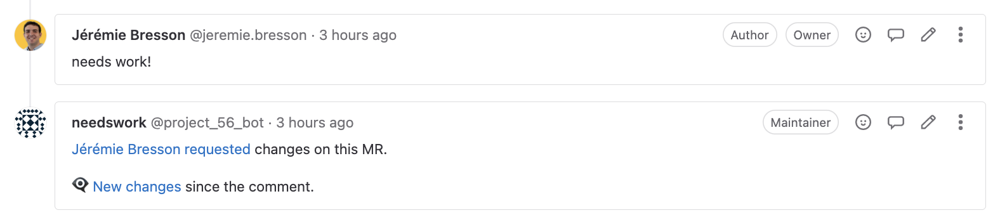

//tag::vardef[]
:gh-repo-owner: unblu
:gh-repo-name: u-needs-work

:project-name: u-needs-work
:git-branch: main
:license: http://www.apache.org/licenses/LICENSE-2.0
:license-name: Apache 2.0 License

:git-repository: {gh-repo-owner}/{gh-repo-name}
:homepage: https://{gh-repo-owner}.github.io/{gh-repo-name}/
:issues: https://github.com/{git-repository}/issues
//end::vardef[]

= {project-name}

Bot for GitLab to implement the "Changes since you last reviewed" feature from Bitbucket.

Corresponding GitLab issue: https://gitlab.com/gitlab-org/gitlab/-/issues/25559[#25559 "View changes since last review" link on MR]

Read more on the link:{homepage}[project home page].

== Get in touch

Use the link:{issues}[{project-name} issue tracker] on GitHub.

== License

link:{license}[{license-name}]
